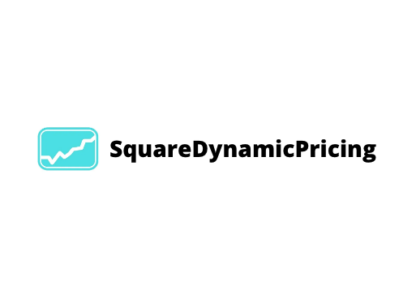
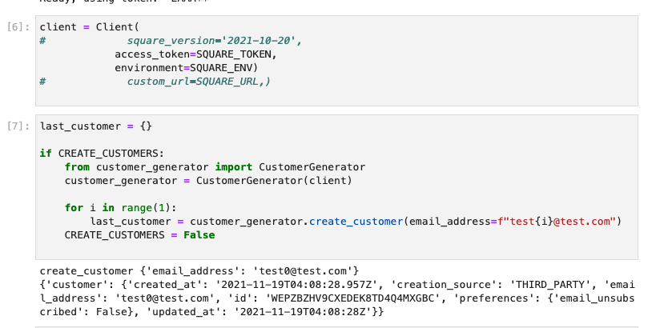
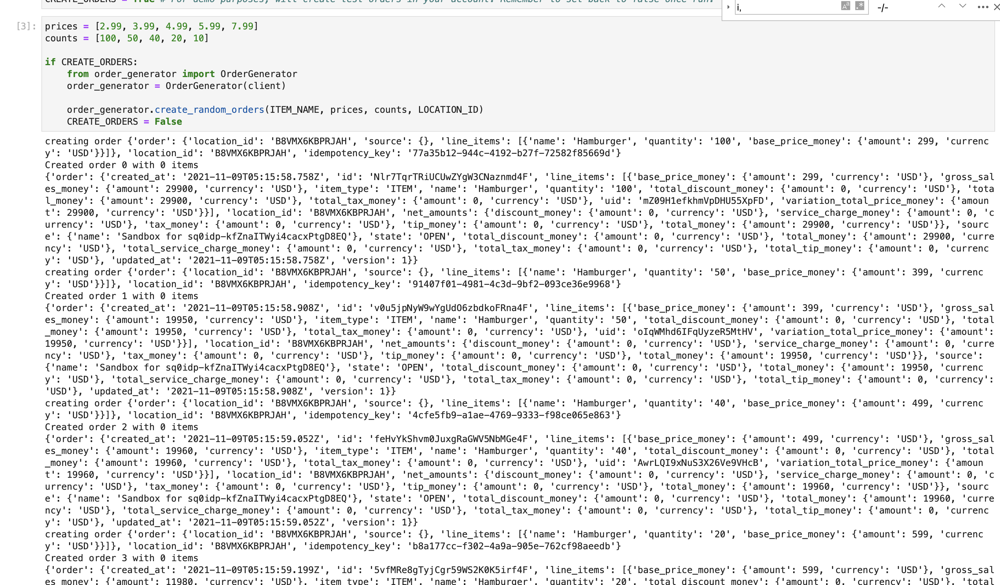
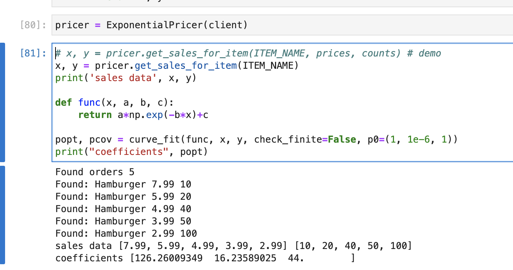
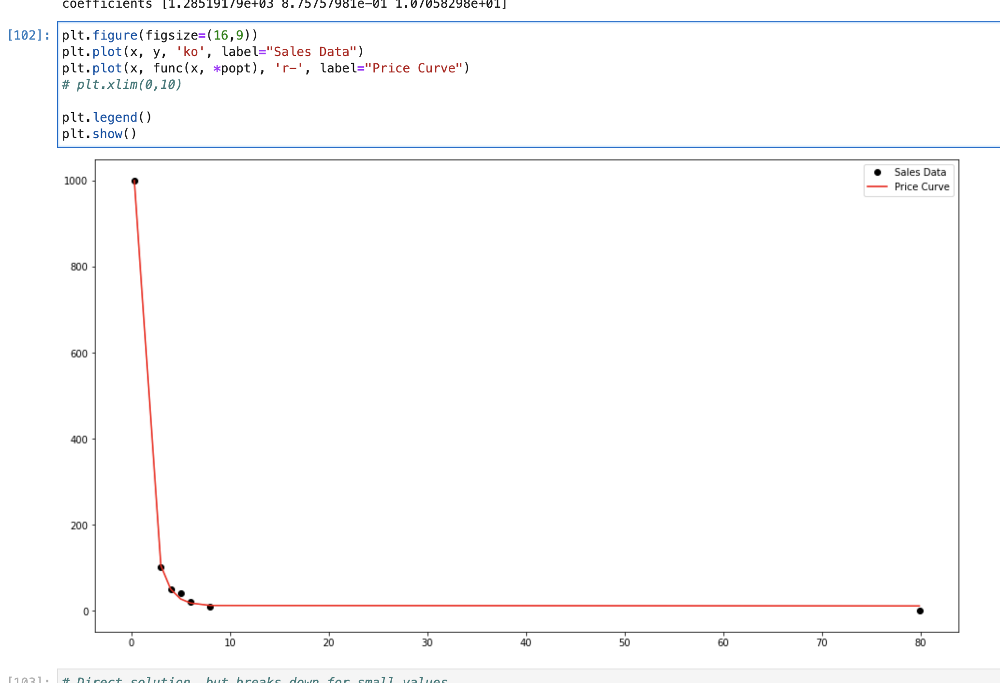
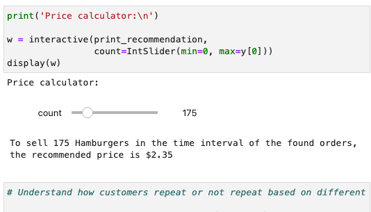
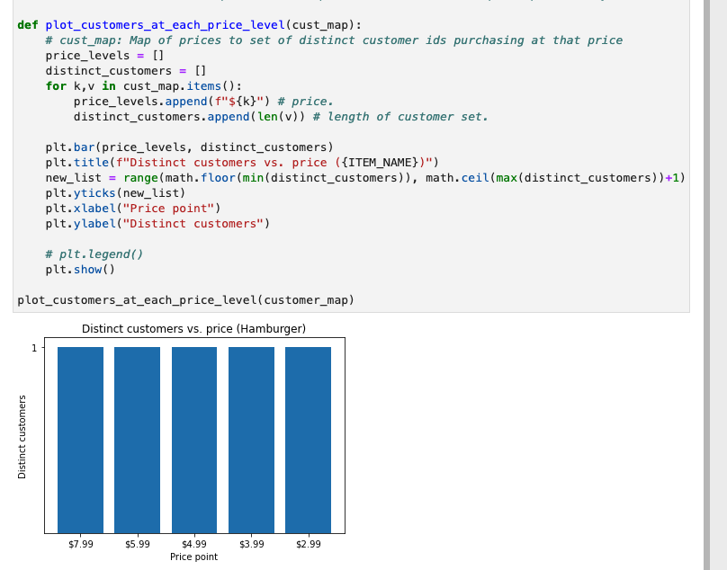

    

SquareDynamicPricing
---

### Context

Coming up with prices is hard, `SquareDynamicPricing` can help you price your items for a desired target volume based on your historic sales data data.

See video for demo: https://youtu.be/keEeoj2gu4g

Built for the Square: Build what's POS_sible hackathon 2021. Note this project is provided as is, and you are welcome to edit/extend the code to fit any use case you wish.

### How it works

Uses the Square orders API to list orders in the user's account (up to preset order limit of 100 which could be extended). Alternatively, the pricing simulation also accepts test/manual input.

If you want to generate test orders/customers for simulation, you can also do so from this notebook via the customer and order API's (see `order_generator` and `customer_generator`). 

After the orders are fetched, an exponential best fit curve is fit to your existing data to come up with a pricing strategy for sales on a particular target item. The curve parameters 

Currently requires the item in question to be sold at different price points within an equivalent time interval for proper comparison.

To use the dynamic slider in jupyter-lab, you'll need to install the below widget.
`jupyter labextension install @jupyter-widgets/jupyterlab-manager`

### Structure

`prices.ipynb`: Core notebook which can connect to your square sandbox or production account given appropriate environment variables.

`customer_generator.py`: Utility for generating customer entries against the Square API using a provided API key.

`order_generator.py`: Utility for generating customer orders against the Square API using a provided API key.

`/img`: Sample screenshots.

### To run:
- Add `SQUARE_TOKEN` (your Square API token) to your environment. By default, this app supports generated test orders for analysis and will run against your sandbox environment.
- Install dependencies in the first cell of `prices.ipynb.`
- Create test orders or run the program against your existing orders. Update the `ITEM_NAME` variable to the item you wish to analyze.
- Scroll to the bottom of the notebook to see the scale for recommended price at different predicted sales volume levels.

### Screenshots

#### Create test customers

#### Create test orders

#### Aggregate orders present in the account with a given item descriptor.

#### Plot the items sold at different price points with two (non-infinite) boundary condition points added for best fit.

#### Use a custom-generated exponential model to determine the (rought) best target price for any arbitrary desired sales volume.

#### Plot distinct customers at each price point (demo data).

